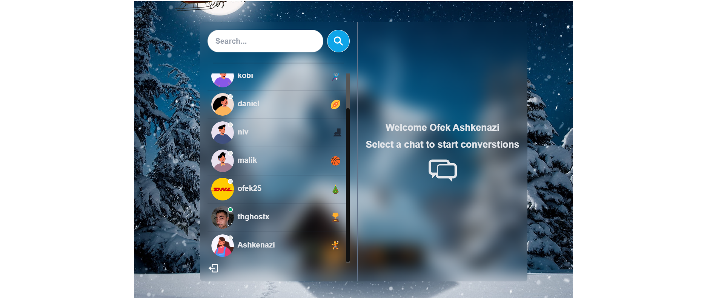
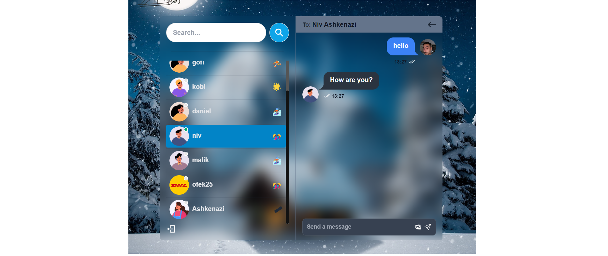
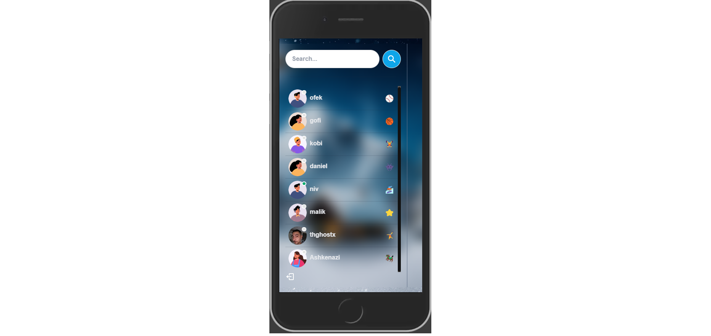
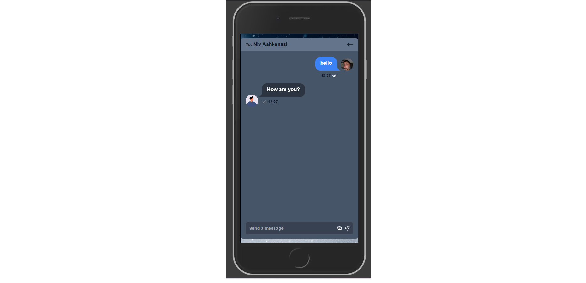

# Chat App
Multi form is a web form that allow the user sign up and choose alot of things plans and add ones.

# Link to live demo
https://chat-app-fzxa.onrender.com/

## Features
- Responsive and well-designed user interface.
- Zustand for store backend data and switch between app state, also connect it socket.io client.
- socket.io client - for real live update msg and images also sound, and im working on real notifcation.
- react icons, react toast. 

## Installation
To run this app locally on your computer, follow these steps:

```bash
Clone the project or download the files
```
```bash
Navigate to the directory and run npm i && npm run server
Navigate to frontend directory and run npm i && npm run dev
```
## be aware that socket works only on live server and not develpoment. if you want you can just change the code in the server and it will work on dev :).
    
## Screenshots

### Login view


### Signup view


### Home page and chat open


### Mobile view Home page and chat open. (login and signup pages are the same.)



## Authors
- [@Ofek Ashkenazi](https://github.com/OfekAshkenazi/)
